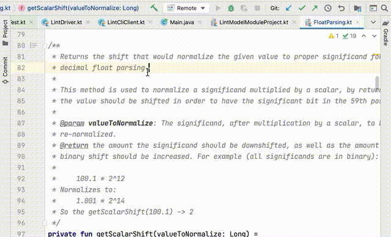
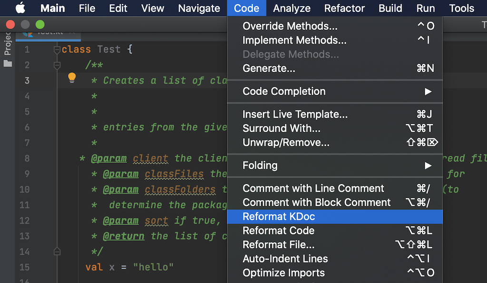

KDoc Formatter
==============

Reformats Kotlin KDoc comments, reflowing text and other cleanup,
both via IDE plugin and command line utility.

This tool reflows comments in KDoc; either on a file or recursively
over nested folders, as well as an IntelliJ IDE plugin where you can
reflow the current comment around the cursor.

Here's an example of the plugin in use, showing editing a comment and
then applying the formatting action to clean it up:



In addition to general cleanup, this is also handy when you're editing
a comment and you need to reflow the paragraph because the current line
is too long or too short:


Features
--------
* Reflow using optimal instead of greedy algorithm (though in the IDE
  plugin you can turn on alternate formatting and invoking
  the action repeatedly alternates between the two modes.)
* Command line script which can recursively format a whole source
  folder.
* IDE plugin to format selected files or current comment. Preserves
  caret position in the current comment. Also hooks into the IDE
  formatting action.
* Gradle plugin to format the source folders in the current project.
* Block tags (like @param) are separated out from the main text, and
  subsequent lines are indented. Blank spaces
  between doc tags are removed. Preformatted text
  (indented 4 spaces or more) is left alone.
* Can be run in a mode where it only reformats comments that were
  touched by the current git HEAD commit, or the
  currently staged files. Can also be passed
  specific line ranges to limit formatting to.
* Multiline comments that would fit on a single line are converted to
  a single line comment (configurable via options)
* Adds hanging indents for ordered and unordered indents.
* Cleans up the double spaces left by the IntelliJ "Convert to
  Kotlin" action right before the closing comment token.
* Removes trailing spaces.
* Can optionally convert various remaining HTML tags in the comments
  to the corresponding KDoc/markdown text. For example, \*\*bold**
  is converted into **bold**, \<p> is converted to a blank line,
  \<h1>Heading\</h1> is converted into # Heading, and so on.
* Support for .editorconfig configuration files to automatically pick
  up line widths. It will normally use the line width configured for
  Kotlin files, but, if Markdown (.md) files are also configured, it
  will use that width as the maximum comment width. This allows you
  to have code line widths of for example 140 but limit comments to
  70 characters (possibly indented). For code, avoiding line breaking
  is helpful, but for text, shorter lines are better for reading.

Command Usage
-------------

```
$ kdoc-formatter
Usage: kdoc-formatter [options] file(s)

Options:
  --max-line-width=<n>
    Sets the length of lines. Defaults to 72.
  --max-comment-width=<n>
    Sets the maximum width of comments. This is helpful in a codebase
    with large line lengths, such as 140 in the IntelliJ codebase. Here,
    you don't want to limit the formatter maximum line width since
    indented code still needs to be properly formatted, but you also
    don't want comments to span 100+ characters, since that's less
    readable. By default this option is not set.
  --hanging-indent=<n>
    Sets the number of spaces to use for hanging indents, e.g. second
    and subsequent lines in a bulleted list or kdoc blog tag.
  --convert-markup
    Convert unnecessary HTML tags like &lt; and &gt; into < and >
  --single-line-comments=<collapse | expand>
    With `collapse`, turns multi-line comments into a single line if it
    fits, and with `expand` it will always format commands with /** and
    */ on their own lines. The default is `collapse`.
  --overlaps-git-changes=<HEAD | staged>
    If git is on the path, and the command is invoked in a git
    repository, kdoc-formatter will invoke git to find the changes either
    in the HEAD commit or in the staged files, and will format only the
    KDoc comments that overlap these changes.
  --lines <start:end>, --line <start>
    Line range(s) to format, like 5:10 (1-based; default is all). Can be
    specified multiple times.
  --greedy
    Instead of the optimal line breaking normally used by kdoc-formatter,
    do greedy line breaking instead
  --dry-run, -n
    Prints the paths of the files whose contents would change if the
    formatter were run normally.
  --quiet, -q
    Quiet mode
  --help, -help, -h
    Print this usage statement.
  @<filename>
    Read filenames from file.

kdoc-formatter: Version 1.4.1
https://github.com/tnorbye/kdoc-formatter
```

IntelliJ Plugin Usage
---------------------
Install the IDE plugin. Then move the caret to a KDoc comment and
invoke Code > Reformat KDoc. You can configure a keyboard shortcut
if you perform this action frequently (go to Preferences, search for
Keymap, and then in the Keymap search field look for "KDoc", and then
double click and choose Add Keyboard Shortcut.

You can also select one or more files in the Project View and invoke
the same action to format whole files.



The above formats only comments. You can also invoke the general
formatting action in the IDE (Code > Reformat Code) and the KDoc formatter
will participate in formatting, updating any comments that overlap
with the formatted text region.

Finally, you can configure various options in the Settings panel. The
line length settings are inherited from the IDE code style or from
the .editorconfig files, if any. However, you can turn on "alternate"
mode where invoking the action repeatedly will toggle between normal
formatting and alternate formatting each time you invoke it. For
a short comment that means toggling between a multi-line and a
single-line comment. But for a longer comment, it will toggle between
optimal line breaking (the default) and greedy line breaking, which
can look better for short paragraphs.

You can also configure whether the formatter should do more than
formatting and actually replace markup constructs like **bold** with
markdown markup.


The plugin is available from the JetBrains Marketplace at
[https://plugins.jetbrains.com/plugin/15734-kotlin-kdoc-formatter](https://plugins.jetbrains.com/plugin/15734-kotlin-kdoc-formatter)

Gradle Plugin Usage
-------------------
The plugin is not yet distributed, so for now, download the zip file
and install it somewhere, then add this to your build.gradle file:

```
buildscript {
    repositories {
        maven { url '/path/to/m2' }
    }
    dependencies {
        classpath "com.github.tnorbye.kdoc-formatter:kdocformatter:1.3.2"
        // (Sorry about the vanity URL --
        // I tried to get kdoc-formatter:kdoc-formatter:1.3.2 but that
        // didn't meet the naming requirements for publishing:
        // https://issues.sonatype.org/browse/OSSRH-63191)
    }
}
plugins {
    id 'kdoc-formatter'
}
kdocformatter {
    options = "--single-line-comments=collapse --max-line-width=100"
}
```

Here, the [options] property lets you use any of the command line
flags from the kdoc-formatter command.

Building and testing
--------------------
To create an installation of the command line tool, run

```
./gradlew install
```

The installation will be located in cli/build/install/kdocformatter.

To create a zip, run

```
./gradlew zip
```

To build the plugin, run

```
./gradlew :plugin:buildPlugin
```

The plugin will be located in plugin/build/distributions/.

To run/test the plugin in the IDE, run

```
./gradlew runIde
```

To reformat the source tree run

```
./gradlew format
```

To build the Gradle plugin locally:

```
cd gradle-plugin
./gradlew publish
```

This will create a Maven local repository in m2/ which you can then
point to from your consuming projects as shown in the Gradle Plugin
Usage section above.

Support Javadoc?
----------------
KDoc is pretty similar to javadoc and there's a good chance that
most of this functionality would work well. However, I already use
[google-java-formatter](https://github.com/google/google-java-format)
to format all Java source code, which does a great job reflowing
javadoc comments already (along with formatting the rest of
the file), so making this tool support Java is not needed.

Integrate into ktlint?
----------------------
I use [ktlint](https://github.com/pinterest/ktlint) to format and
pretty-print my Kotlin source code. However, it does not do comment
reformatting, which means I spend time either manually reflowing
myself when I edit comments, or worse, leave it unformatted.

Given that I use ktlint for formatting, the Right Thing would
have been for me to figure out how it works, and implement the
functionality there. However, I'm busy with a million other things,
and this was just a quick weekend -- which unfortunately satisfies my
immediate formatting needs -- so I no longer have the same motivation
to get ktlint to support it.
